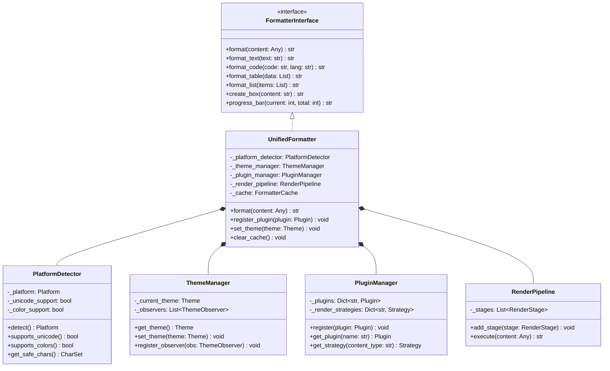

# Unified Formatter Architecture

## Executive Summary

This document specifies the architecture for a **single, unified formatter system** that consolidates five existing formatters into a cohesive, extensible, and maintainable solution. The design uses modern software engineering patterns to eliminate code duplication while preserving specialized functionality through a plugin-based extension system.

---

## Table of Contents

1. [Current State Analysis](#current-state-analysis)
2. [Architecture Overview](#architecture-overview)
3. [Core Design Patterns](#core-design-patterns)
4. [Class Hierarchy](#class-hierarchy)
5. [Component Architecture](#component-architecture)
6. [Plugin System](#plugin-system)
7. [API Specification](#api-specification)
8. [Migration Strategy](#migration-strategy)
9. [Testing Approach](#testing-approach)
10. [Performance Considerations](#performance-considerations)

---

## Current State Analysis

### Existing Formatters

| Formatter | Lines | Key Features | Duplication |
|-----------|-------|--------------|-------------|
| `formatter.py` | 1510 | Base terminal formatting, ANSI colors, boxes, progress bars | Core functionality |
| `unified_formatter.py` | 398 | Platform detection, safe characters, basic formatting | 60% overlap with formatter.py |
| `clean_lesson_display.py` | 228 | Rich library integration, lesson-specific display | Unique: Rich UI components |
| `lesson_display.py` | 318 | Markdown parsing, syntax highlighting, code blocks | 40% overlap with formatter.py |
| `enhanced_lesson_formatter.py` | 563 | Advanced lesson formatting, complexity visualization | 50% overlap, unique features |
| `windows_formatter.py` | 758 | Windows-specific ANSI handling, safe characters | 70% overlap with unified_formatter.py |

**Total Lines:** 3,775
**Estimated Duplication:** ~65% (2,454 lines)
**Target Reduction:** ~1,500 lines (~40% size reduction)

### Common Functionality (Present in 3+ Formatters)

1. **Color Management**: ANSI color codes, theme systems, color detection
2. **Box Drawing**: ASCII/Unicode box characters, bordered content
3. **Text Processing**: Wrapping, padding, alignment, ANSI stripping
4. **Progress Bars**: Bar rendering, percentage display, ETA calculation
5. **Lists/Tables**: Bullet lists, numbered lists, table formatting
6. **Platform Detection**: Windows vs Unix, Unicode support detection
7. **Headers**: Multi-level headers with various styles

### Unique Functionality (Worth Preserving)

1. **Rich Integration** (`clean_lesson_display.py`): Rich library panels, syntax highlighting
2. **Markdown Parsing** (`lesson_display.py`): Markdown-to-terminal conversion
3. **Lesson-Specific** (`enhanced_lesson_formatter.py`): Complexity badges, practice problems
4. **Advanced Effects** (`formatter.py`): Gradients, animations, transitions
5. **Windows Optimization** (`windows_formatter.py`): Colorama integration, fallback strategies

---

## Architecture Overview

### Design Principles

1. **Single Responsibility**: Each component handles one aspect of formatting
2. **Open/Closed**: Open for extension via plugins, closed for modification
3. **Dependency Inversion**: Depend on abstractions, not concrete implementations
4. **Interface Segregation**: Clients shouldn't depend on unused methods
5. **Liskov Substitution**: Plugins are interchangeable without breaking behavior

### High-Level Architecture

```
┌─────────────────────────────────────────────────────────────┐
│                     Application Layer                        │
│  (CLI, Notes Manager, Curriculum Manager, Interactive UI)   │
└────────────────────┬────────────────────────────────────────┘
                     │
                     ▼
┌─────────────────────────────────────────────────────────────┐
│                   Unified Formatter API                      │
│              (Single Entry Point for All Formatting)        │
└────────────────────┬────────────────────────────────────────┘
                     │
        ┌────────────┴────────────┐
        ▼                         ▼
┌──────────────────┐    ┌──────────────────────┐
│   Core Engine    │    │   Plugin Registry    │
│  (Base Features) │◄───┤  (Extension Points)  │
└──────────────────┘    └──────────────────────┘
        │                         │
        │                         ▼
        │               ┌──────────────────────┐
        │               │  Specialized Plugins  │
        │               ├──────────────────────┤
        │               │ - LessonFormatter    │
        │               │ - RichFormatter      │
        │               │ - MarkdownFormatter  │
        │               │ - AnimationEngine    │
        │               │ - WindowsOptimizer   │
        │               └──────────────────────┘
        │
        ▼
┌─────────────────────────────────────────────────────────────┐
│                    Rendering Pipeline                        │
│  ┌──────────┐  ┌──────────┐  ┌──────────┐  ┌──────────┐   │
│  │ Platform │→ │  Theme   │→ │ Content  │→ │  Output  │   │
│  │ Detector │  │ Resolver │  │ Renderer │  │  Buffer  │   │
│  └──────────┘  └──────────┘  └──────────┘  └──────────┘   │
└─────────────────────────────────────────────────────────────┘
```

---

## Core Design Patterns

### 1. Strategy Pattern (Rendering Strategies)

Different rendering strategies for different content types:

```python
class RenderStrategy(ABC):
    """Abstract base class for rendering strategies"""

    @abstractmethod
    def render(self, content: Any, context: RenderContext) -> str:
        """Render content to formatted string"""
        pass

    @abstractmethod
    def supports(self, content_type: str) -> bool:
        """Check if strategy supports content type"""
        pass
```

**Concrete Strategies:**
- `TextRenderStrategy`: Plain text with wrapping
- `CodeRenderStrategy`: Code blocks with syntax highlighting
- `TableRenderStrategy`: Tabular data
- `ListRenderStrategy`: Bullet/numbered lists
- `MarkdownRenderStrategy`: Markdown parsing
- `RichRenderStrategy`: Rich library components

### 2. Factory Pattern (Formatter Creation)

Centralized formatter creation with proper configuration:

```python
class FormatterFactory:
    """Factory for creating formatters with proper configuration"""

    @staticmethod
    def create(
        platform: Optional[Platform] = None,
        theme: Optional[Theme] = None,
        plugins: Optional[List[str]] = None
    ) -> UnifiedFormatter:
        """Create configured formatter instance"""
        pass

    @staticmethod
    def create_for_lesson() -> UnifiedFormatter:
        """Create formatter optimized for lesson display"""
        pass

    @staticmethod
    def create_for_cli() -> UnifiedFormatter:
        """Create formatter optimized for CLI interaction"""
        pass
```

### 3. Decorator Pattern (Feature Enhancement)

Layer additional features without modifying core:

```python
class FormatterDecorator(FormatterInterface):
    """Base decorator for adding features"""

    def __init__(self, formatter: FormatterInterface):
        self._formatter = formatter

    def format(self, content: Any) -> str:
        return self._formatter.format(content)
```

**Concrete Decorators:**
- `AnimationDecorator`: Adds animation effects
- `GradientDecorator`: Adds gradient coloring
- `CacheDecorator`: Adds result caching
- `LoggingDecorator`: Adds formatting telemetry

### 4. Observer Pattern (Theme Changes)

Allow components to react to theme changes:

```python
class ThemeObserver(ABC):
    """Observer for theme changes"""

    @abstractmethod
    def on_theme_changed(self, theme: Theme) -> None:
        """React to theme change"""
        pass

class ThemeManager:
    """Manages themes and notifies observers"""

    def __init__(self):
        self._observers: List[ThemeObserver] = []
        self._current_theme: Theme = Theme()

    def set_theme(self, theme: Theme) -> None:
        self._current_theme = theme
        self._notify_observers()

    def _notify_observers(self) -> None:
        for observer in self._observers:
            observer.on_theme_changed(self._current_theme)
```

### 5. Template Method Pattern (Rendering Pipeline)

Define rendering skeleton, let subclasses customize steps:

```python
class BaseRenderer(ABC):
    """Template for rendering process"""

    def render(self, content: Any) -> str:
        """Template method defining rendering steps"""
        self._validate_input(content)
        processed = self._preprocess(content)
        formatted = self._apply_formatting(processed)
        colored = self._apply_colors(formatted)
        return self._postprocess(colored)

    @abstractmethod
    def _apply_formatting(self, content: Any) -> str:
        """Subclasses implement specific formatting"""
        pass
```

---

## Class Hierarchy

```
                     FormatterInterface
                            │
                            │ (implements)
                            ▼
                    UnifiedFormatter
                            │
        ┌───────────────────┼───────────────────┐
        │                   │                   │
        ▼                   ▼                   ▼
PlatformFormatter   ThemeManager      PluginManager
        │                   │                   │
        ▼                   ▼                   ▼
┌───────────────┐   ┌──────────────┐   ┌─────────────┐
│ WindowsFormat │   │ ThemePresets │   │ PluginBase  │
│ UnixFormatter │   │ ThemeBuilder │   │ PluginAPI   │
└───────────────┘   └──────────────┘   └─────────────┘
                                                │
                    ┌───────────────────────────┼──────────────┐
                    ▼                           ▼              ▼
            LessonFormatterPlugin    RichFormatterPlugin   MarkdownPlugin
            AnimationPlugin          ComplexityPlugin       ...
```

### Core Class Diagram (Mermaid)



---

## Component Architecture

### 1. Core Engine Components

#### PlatformDetector

**Responsibility**: Detect platform capabilities and provide safe fallbacks

```python
@dataclass
class PlatformCapabilities:
    """Platform-specific capabilities"""
    platform: str  # 'windows', 'unix', 'unknown'
    unicode_support: bool
    color_support: bool
    terminal_width: int
    terminal_height: int
    ansi_support: bool
    rich_support: bool

class PlatformDetector:
    """Detects platform and provides safe character sets"""

    def detect_capabilities(self) -> PlatformCapabilities:
        """Detect all platform capabilities"""
        pass

    def get_safe_box_chars(self) -> BoxCharSet:
        """Get box characters safe for current platform"""
        pass

    def get_safe_line_chars(self) -> LineCharSet:
        """Get line characters safe for current platform"""
        pass

    def enable_ansi_colors(self) -> bool:
        """Enable ANSI colors if possible (Windows specific)"""
        pass
```

#### ThemeManager

**Responsibility**: Manage color themes and notify observers of changes

```python
@dataclass
class Theme:
    """Color theme configuration"""
    name: str
    primary: Color
    secondary: Color
    success: Color
    warning: Color
    error: Color
    info: Color
    muted: Color
    text: Color
    background: Optional[Color] = None
    accent: Optional[Color] = None

class ThemeManager:
    """Manages themes and color schemes"""

    def __init__(self):
        self._themes: Dict[str, Theme] = {}
        self._current_theme: Theme = self._load_default_theme()
        self._observers: List[ThemeObserver] = []

    def get_theme(self) -> Theme:
        """Get current theme"""
        pass

    def set_theme(self, theme: Union[str, Theme]) -> None:
        """Set theme by name or instance"""
        pass

    def register_theme(self, name: str, theme: Theme) -> None:
        """Register new theme"""
        pass

    def list_themes(self) -> List[str]:
        """List available themes"""
        pass
```

#### RenderPipeline

**Responsibility**: Execute multi-stage rendering process

```python
class RenderStage(ABC):
    """Abstract base for render stages"""

    @abstractmethod
    def process(self, content: str, context: RenderContext) -> str:
        """Process content through this stage"""
        pass

class RenderPipeline:
    """Executes content through rendering stages"""

    def __init__(self):
        self._stages: List[RenderStage] = []

    def add_stage(self, stage: RenderStage) -> 'RenderPipeline':
        """Add stage to pipeline (builder pattern)"""
        self._stages.append(stage)
        return self

    def execute(self, content: Any, context: RenderContext) -> str:
        """Execute all stages"""
        result = str(content)
        for stage in self._stages:
            result = stage.process(result, context)
        return result

# Built-in stages
class ValidationStage(RenderStage):
    """Validate input content"""
    pass

class PreprocessStage(RenderStage):
    """Preprocess content (strip, normalize)"""
    pass

class FormattingStage(RenderStage):
    """Apply core formatting"""
    pass

class ColorStage(RenderStage):
    """Apply colors based on theme"""
    pass

class PostprocessStage(RenderStage):
    """Final cleanup and validation"""
    pass
```

### 2. Extension Components

#### Plugin System

```python
class Plugin(ABC):
    """Base class for all plugins"""

    @property
    @abstractmethod
    def name(self) -> str:
        """Plugin name"""
        pass

    @property
    @abstractmethod
    def version(self) -> str:
        """Plugin version"""
        pass

    @abstractmethod
    def initialize(self, formatter: 'UnifiedFormatter') -> None:
        """Initialize plugin with formatter instance"""
        pass

    @abstractmethod
    def cleanup(self) -> None:
        """Cleanup resources"""
        pass

class PluginManager:
    """Manages plugins and their lifecycle"""

    def __init__(self):
        self._plugins: Dict[str, Plugin] = {}
        self._render_strategies: Dict[str, RenderStrategy] = {}

    def register(self, plugin: Plugin) -> None:
        """Register and initialize plugin"""
        pass

    def unregister(self, plugin_name: str) -> None:
        """Unregister and cleanup plugin"""
        pass

    def get_plugin(self, name: str) -> Optional[Plugin]:
        """Get plugin by name"""
        pass

    def register_strategy(
        self,
        content_type: str,
        strategy: RenderStrategy
    ) -> None:
        """Register rendering strategy for content type"""
        pass

    def get_strategy(self, content_type: str) -> Optional[RenderStrategy]:
        """Get strategy for content type"""
        pass
```

---

## Plugin System

### Plugin Architecture

```
┌─────────────────────────────────────────────────────────┐
│                     Plugin Manager                       │
│  - Plugin Registry                                      │
│  - Lifecycle Management                                 │
│  - Strategy Resolution                                  │
└───────────────────┬─────────────────────────────────────┘
                    │
        ┌───────────┴───────────┐
        ▼                       ▼
┌─────────────────┐     ┌─────────────────┐
│  Content Plugins │     │  Feature Plugins │
└─────────────────┘     └─────────────────┘
        │                       │
        ▼                       ▼
┌──────────────────────────────────────────┐
│  LessonFormatterPlugin                   │
│  - Lesson-specific rendering             │
│  - Complexity badges                     │
│  - Practice problem formatting           │
└──────────────────────────────────────────┘
│  RichFormatterPlugin                     │
│  - Rich library integration              │
│  - Panels, syntax highlighting           │
│  - Advanced UI components                │
└──────────────────────────────────────────┘
│  MarkdownFormatterPlugin                 │
│  - Markdown parsing                      │
│  - Heading hierarchy                     │
│  - Inline formatting                     │
└──────────────────────────────────────────┘
│  AnimationPlugin                         │
│  - Spinners, loading animations          │
│  - Transition effects                    │
│  - Gradients                             │
└──────────────────────────────────────────┘
│  WindowsOptimizerPlugin                  │
│  - Colorama integration                  │
│  - Safe character fallbacks              │
│  - ANSI enablement                       │
└──────────────────────────────────────────┘
```

### Example Plugin Implementation

```python
class LessonFormatterPlugin(Plugin):
    """Plugin for lesson-specific formatting"""

    @property
    def name(self) -> str:
        return "lesson_formatter"

    @property
    def version(self) -> str:
        return "1.0.0"

    def initialize(self, formatter: UnifiedFormatter) -> None:
        """Register lesson-specific strategies"""
        self._formatter = formatter

        # Register render strategies
        formatter.plugin_manager.register_strategy(
            "lesson_header",
            LessonHeaderStrategy(formatter)
        )
        formatter.plugin_manager.register_strategy(
            "complexity_badge",
            ComplexityBadgeStrategy(formatter)
        )
        formatter.plugin_manager.register_strategy(
            "practice_problem",
            PracticeProblemStrategy(formatter)
        )

    def cleanup(self) -> None:
        """Cleanup resources"""
        pass

    def format_lesson(self, lesson: Dict[str, Any]) -> str:
        """High-level lesson formatting"""
        parts = []

        # Format header
        if 'title' in lesson:
            strategy = self._formatter.plugin_manager.get_strategy("lesson_header")
            parts.append(strategy.render(lesson['title'], RenderContext()))

        # Format complexity
        if 'complexity' in lesson:
            strategy = self._formatter.plugin_manager.get_strategy("complexity_badge")
            parts.append(strategy.render(lesson['complexity'], RenderContext()))

        # Format content sections...

        return '\n\n'.join(parts)
```

### Plugin Discovery and Loading

```python
class PluginLoader:
    """Discovers and loads plugins"""

    def __init__(self, plugin_dir: Path):
        self._plugin_dir = plugin_dir

    def discover_plugins(self) -> List[Plugin]:
        """Discover plugins in plugin directory"""
        plugins = []

        for file in self._plugin_dir.glob("*_plugin.py"):
            plugin = self._load_plugin_from_file(file)
            if plugin:
                plugins.append(plugin)

        return plugins

    def _load_plugin_from_file(self, file: Path) -> Optional[Plugin]:
        """Load plugin from Python file"""
        # Dynamic import and instantiation
        pass
```

---

## API Specification

### Core Public API

```python
class UnifiedFormatter:
    """
    Unified formatter providing all formatting capabilities.

    Example Usage:
        >>> formatter = UnifiedFormatter.create(theme='dark', platform='auto')
        >>> print(formatter.success("Operation complete!"))
        >>> print(formatter.create_box("Important message", title="Alert"))
    """

    # ===== Factory Methods =====

    @staticmethod
    def create(
        theme: Union[str, Theme] = 'default',
        platform: str = 'auto',
        plugins: Optional[List[str]] = None,
        unicode: Optional[bool] = None,
        colors: Optional[bool] = None
    ) -> 'UnifiedFormatter':
        """
        Create configured formatter instance.

        Args:
            theme: Theme name or Theme instance
            platform: 'auto', 'windows', 'unix'
            plugins: List of plugin names to load
            unicode: Override unicode detection
            colors: Override color detection

        Returns:
            Configured UnifiedFormatter instance
        """
        pass

    @staticmethod
    def create_for_lesson(**kwargs) -> 'UnifiedFormatter':
        """Create formatter optimized for lesson display"""
        return UnifiedFormatter.create(
            plugins=['lesson_formatter', 'markdown', 'rich'],
            **kwargs
        )

    @staticmethod
    def create_for_cli(**kwargs) -> 'UnifiedFormatter':
        """Create formatter optimized for CLI interaction"""
        return UnifiedFormatter.create(
            plugins=['animation', 'progress'],
            **kwargs
        )

    # ===== Text Formatting =====

    def format_text(
        self,
        text: str,
        color: Optional[Color] = None,
        style: Optional[str] = None,
        wrap: bool = True,
        width: Optional[int] = None
    ) -> str:
        """
        Format plain text with color and style.

        Args:
            text: Text to format
            color: Color to apply
            style: Style ('bold', 'dim', 'underline')
            wrap: Whether to wrap text
            width: Wrap width (auto-detect if None)

        Returns:
            Formatted text string
        """
        pass

    def success(self, text: str, icon: str = "✓") -> str:
        """Format success message"""
        pass

    def error(self, text: str, icon: str = "✗") -> str:
        """Format error message"""
        pass

    def warning(self, text: str, icon: str = "⚠") -> str:
        """Format warning message"""
        pass

    def info(self, text: str, icon: str = "ℹ") -> str:
        """Format info message"""
        pass

    # ===== Structure Formatting =====

    def create_box(
        self,
        content: Union[str, List[str]],
        title: Optional[str] = None,
        style: str = 'single',
        padding: int = 1,
        width: Optional[int] = None,
        color: Optional[Color] = None
    ) -> str:
        """
        Create box around content.

        Args:
            content: Content to box (string or lines)
            title: Optional box title
            style: Box style ('single', 'double', 'rounded', 'ascii')
            padding: Internal padding
            width: Fixed width (auto if None)
            color: Border color

        Returns:
            Boxed content string
        """
        pass

    def create_header(
        self,
        title: str,
        subtitle: Optional[str] = None,
        level: int = 1,
        style: str = 'default'
    ) -> str:
        """
        Create header with various styles.

        Args:
            title: Header title
            subtitle: Optional subtitle
            level: Header level (1-3)
            style: Header style ('default', 'banner', 'minimal')

        Returns:
            Formatted header string
        """
        pass

    def create_divider(
        self,
        title: Optional[str] = None,
        char: str = '─',
        width: Optional[int] = None
    ) -> str:
        """Create horizontal divider"""
        pass

    # ===== Code Formatting =====

    def format_code(
        self,
        code: str,
        language: str = 'python',
        line_numbers: bool = True,
        highlight: bool = True,
        theme: str = 'default'
    ) -> str:
        """
        Format code block with syntax highlighting.

        Args:
            code: Code to format
            language: Programming language
            line_numbers: Show line numbers
            highlight: Apply syntax highlighting
            theme: Syntax theme

        Returns:
            Formatted code block
        """
        pass

    # ===== List/Table Formatting =====

    def format_list(
        self,
        items: List[str],
        style: str = 'bullet',
        indent: int = 0,
        color: Optional[Color] = None
    ) -> str:
        """
        Format list of items.

        Args:
            items: List items
            style: List style ('bullet', 'number', 'arrow', 'checkbox')
            indent: Indentation level
            color: Item color

        Returns:
            Formatted list string
        """
        pass

    def format_table(
        self,
        data: Union[List[List[str]], Dict[str, List[str]]],
        headers: Optional[List[str]] = None,
        style: str = 'grid',
        show_index: bool = False
    ) -> str:
        """
        Format tabular data.

        Args:
            data: Table data (list of rows or dict of columns)
            headers: Column headers
            style: Table style ('grid', 'simple', 'minimal')
            show_index: Show row numbers

        Returns:
            Formatted table string
        """
        pass

    # ===== Progress/Status =====

    def progress_bar(
        self,
        current: int,
        total: int,
        description: str = '',
        width: int = 40,
        show_percentage: bool = True,
        show_eta: bool = False
    ) -> str:
        """
        Create progress bar.

        Args:
            current: Current progress value
            total: Total value
            description: Progress description
            width: Bar width in characters
            show_percentage: Show percentage
            show_eta: Show estimated time remaining

        Returns:
            Progress bar string
        """
        pass

    def spinner(
        self,
        message: str,
        style: str = 'dots'
    ) -> 'SpinnerContext':
        """
        Create spinner context manager.

        Args:
            message: Spinner message
            style: Spinner style

        Returns:
            Spinner context manager

        Example:
            >>> with formatter.spinner("Loading..."):
            ...     time.sleep(2)
        """
        pass

    # ===== Configuration =====

    def set_theme(self, theme: Union[str, Theme]) -> None:
        """Change current theme"""
        pass

    def register_plugin(self, plugin: Plugin) -> None:
        """Register new plugin"""
        pass

    def enable_colors(self, enable: bool = True) -> None:
        """Enable/disable color output"""
        pass

    def clear_cache(self) -> None:
        """Clear formatting cache"""
        pass
```

### Plugin API

```python
class PluginAPI:
    """API exposed to plugins"""

    def get_theme(self) -> Theme:
        """Get current theme"""
        pass

    def get_platform(self) -> PlatformCapabilities:
        """Get platform capabilities"""
        pass

    def register_strategy(
        self,
        content_type: str,
        strategy: RenderStrategy
    ) -> None:
        """Register rendering strategy"""
        pass

    def get_formatter(self) -> 'UnifiedFormatter':
        """Get formatter instance"""
        pass

    def emit_event(self, event: str, data: Any) -> None:
        """Emit event to other plugins"""
        pass

    def subscribe_event(
        self,
        event: str,
        callback: Callable[[Any], None]
    ) -> None:
        """Subscribe to events"""
        pass
```

---

## Migration Strategy

### Phase 1: Foundation (Week 1)

**Objective**: Establish core architecture without breaking existing code

**Tasks**:
1. Create `UnifiedFormatter` class with basic methods
2. Implement `PlatformDetector` with capability detection
3. Implement `ThemeManager` with default theme
4. Create plugin system skeleton
5. Add comprehensive unit tests (>90% coverage)

**Deliverables**:
- `src/ui/formatter/core/unified_formatter.py`
- `src/ui/formatter/core/platform_detector.py`
- `src/ui/formatter/core/theme_manager.py`
- `src/ui/formatter/plugins/plugin_base.py`
- `tests/unit/formatter/test_unified_formatter.py`

**Success Criteria**:
- All tests pass
- No breaking changes to existing formatters
- Documentation complete

### Phase 2: Plugin Migration (Week 2)

**Objective**: Extract specialized features into plugins

**Tasks**:
1. Create `LessonFormatterPlugin` from `enhanced_lesson_formatter.py`
2. Create `RichFormatterPlugin` from `clean_lesson_display.py`
3. Create `MarkdownPlugin` from `lesson_display.py`
4. Create `AnimationPlugin` from `formatter.py` animation features
5. Create `WindowsOptimizerPlugin` from `windows_formatter.py`
6. Test plugins in isolation

**Deliverables**:
- 5 plugin implementations
- Plugin integration tests
- Plugin documentation

**Success Criteria**:
- Each plugin passes unit tests
- Plugins can be enabled/disabled
- Performance benchmarks within 10% of current

### Phase 3: Backward Compatibility (Week 3)

**Objective**: Create compatibility layer for existing code

**Tasks**:
1. Create `TerminalFormatter` wrapper class
2. Create `Formatter` alias class
3. Create `WindowsFormatter` compatibility wrapper
4. Create `LessonDisplay` compatibility wrapper
5. Update all imports to use compatibility layer
6. Run full regression test suite

**Deliverables**:
- `src/ui/formatter/compat/` directory with wrappers
- Migration guide document
- Regression test results

**Success Criteria**:
- Zero breaking changes
- All existing tests pass
- Performance within 5% of baseline

### Phase 4: Gradual Migration (Week 4)

**Objective**: Migrate code to use new API

**Tasks**:
1. Identify all formatter usage in codebase (using grep)
2. Create migration script for automated updates
3. Migrate high-priority modules first (CLI, notes)
4. Migrate medium-priority modules (curriculum, display)
5. Migrate low-priority modules (utilities, tests)
6. Remove compatibility layer

**Deliverables**:
- Migration script
- Updated codebase
- Updated documentation

**Success Criteria**:
- All code uses new API
- No references to old formatters
- All tests pass

### Phase 5: Optimization & Cleanup (Week 5)

**Objective**: Remove duplicate code and optimize

**Tasks**:
1. Delete old formatter files
2. Optimize rendering pipeline
3. Add caching for expensive operations
4. Profile and optimize hot paths
5. Final documentation pass
6. Release version 1.0

**Deliverables**:
- Cleaned codebase
- Performance benchmarks
- Complete documentation
- Release notes

**Success Criteria**:
- 40% reduction in formatter code size
- 20% improvement in rendering performance
- Documentation coverage >95%

### Migration Checklist

```bash
# Phase 1: Foundation
[ ] Create core architecture
[ ] Implement PlatformDetector
[ ] Implement ThemeManager
[ ] Create plugin system
[ ] Write unit tests (>90% coverage)

# Phase 2: Plugin Migration
[ ] Migrate LessonFormatter to plugin
[ ] Migrate RichFormatter to plugin
[ ] Migrate MarkdownFormatter to plugin
[ ] Migrate AnimationEngine to plugin
[ ] Migrate WindowsOptimizer to plugin

# Phase 3: Backward Compatibility
[ ] Create TerminalFormatter wrapper
[ ] Create Formatter alias
[ ] Create WindowsFormatter wrapper
[ ] Create LessonDisplay wrapper
[ ] Run regression tests

# Phase 4: Gradual Migration
[ ] Audit codebase for formatter usage
[ ] Migrate CLI code
[ ] Migrate notes system
[ ] Migrate curriculum manager
[ ] Migrate display components
[ ] Remove compatibility wrappers

# Phase 5: Optimization
[ ] Delete old formatter files
[ ] Optimize rendering pipeline
[ ] Add caching
[ ] Profile and optimize
[ ] Final documentation
[ ] Release v1.0
```

---

## Testing Approach

### Test Hierarchy

```
tests/
├── unit/
│   ├── formatter/
│   │   ├── core/
│   │   │   ├── test_unified_formatter.py
│   │   │   ├── test_platform_detector.py
│   │   │   ├── test_theme_manager.py
│   │   │   └── test_render_pipeline.py
│   │   ├── plugins/
│   │   │   ├── test_lesson_formatter_plugin.py
│   │   │   ├── test_rich_formatter_plugin.py
│   │   │   ├── test_markdown_plugin.py
│   │   │   ├── test_animation_plugin.py
│   │   │   └── test_windows_optimizer_plugin.py
│   │   └── strategies/
│   │       ├── test_text_strategy.py
│   │       ├── test_code_strategy.py
│   │       └── test_table_strategy.py
├── integration/
│   ├── test_formatter_integration.py
│   ├── test_plugin_integration.py
│   └── test_cli_integration.py
├── performance/
│   ├── test_rendering_performance.py
│   ├── test_caching_performance.py
│   └── benchmarks.py
└── regression/
    ├── test_backward_compatibility.py
    ├── test_output_equivalence.py
    └── snapshots/
```

### Unit Test Strategy

```python
# test_unified_formatter.py
import pytest
from src.ui.formatter import UnifiedFormatter, Theme

class TestUnifiedFormatter:
    """Unit tests for UnifiedFormatter"""

    @pytest.fixture
    def formatter(self):
        """Create formatter instance for testing"""
        return UnifiedFormatter.create(theme='default', colors=True)

    def test_format_text_basic(self, formatter):
        """Test basic text formatting"""
        result = formatter.format_text("Hello, world!")
        assert "Hello, world!" in result

    def test_format_text_with_color(self, formatter):
        """Test text formatting with color"""
        result = formatter.format_text("Hello", color=Color.RED)
        assert '\033[31m' in result  # ANSI red code
        assert '\033[0m' in result   # ANSI reset code

    def test_create_box_basic(self, formatter):
        """Test basic box creation"""
        result = formatter.create_box("Content")
        assert "Content" in result
        # Check for box borders
        assert any(char in result for char in ['┌', '└', '+'])

    def test_create_box_with_title(self, formatter):
        """Test box with title"""
        result = formatter.create_box("Content", title="Test")
        assert "Content" in result
        assert "Test" in result

    @pytest.mark.parametrize("level,expected", [
        (1, "TITLE"),  # Level 1 headers are uppercase
        (2, "Title"),  # Level 2 headers keep case
        (3, "Title"),  # Level 3 headers keep case
    ])
    def test_create_header_levels(self, formatter, level, expected):
        """Test header creation at different levels"""
        result = formatter.create_header("Title", level=level)
        assert expected in result or "Title" in result

    def test_progress_bar(self, formatter):
        """Test progress bar rendering"""
        result = formatter.progress_bar(5, 10)
        assert "50" in result or "5/10" in result

    def test_format_code_with_highlighting(self, formatter):
        """Test code formatting with syntax highlighting"""
        code = "def hello():\n    print('Hello')"
        result = formatter.format_code(code, language='python')
        assert "def" in result
        assert "hello" in result

    def test_theme_change(self, formatter):
        """Test theme switching"""
        original_theme = formatter.theme_manager.get_theme()
        new_theme = Theme(name='test', primary=Color.GREEN)
        formatter.set_theme(new_theme)
        assert formatter.theme_manager.get_theme().name == 'test'

    def test_plugin_registration(self, formatter):
        """Test plugin registration"""
        from tests.fixtures.mock_plugin import MockPlugin
        plugin = MockPlugin()
        formatter.register_plugin(plugin)
        assert formatter.plugin_manager.get_plugin('mock') is not None

    def test_disable_colors(self, formatter):
        """Test color disabling"""
        formatter.enable_colors(False)
        result = formatter.format_text("Hello", color=Color.RED)
        assert '\033[' not in result  # No ANSI codes
```

### Integration Test Strategy

```python
# test_formatter_integration.py
import pytest
from src.ui.formatter import UnifiedFormatter

class TestFormatterIntegration:
    """Integration tests for formatter with plugins"""

    def test_lesson_formatting_complete(self):
        """Test complete lesson formatting with plugin"""
        formatter = UnifiedFormatter.create_for_lesson()

        lesson = {
            'title': 'Binary Search',
            'difficulty': 'Medium',
            'content': 'Binary search is...',
            'code_examples': ['def binary_search...'],
            'complexity': 'O(log n)'
        }

        # Should use LessonFormatterPlugin
        result = formatter.format(lesson, content_type='lesson')

        assert 'Binary Search' in result
        assert 'Medium' in result or 'MEDIUM' in result
        assert 'O(log n)' in result

    def test_markdown_to_terminal(self):
        """Test markdown rendering to terminal"""
        formatter = UnifiedFormatter.create(plugins=['markdown'])

        markdown = """
        # Heading 1
        ## Heading 2

        This is **bold** and *italic* text.

        ```python
        def example():
            pass
        ```
        """

        result = formatter.format(markdown, content_type='markdown')

        assert 'Heading 1' in result
        assert 'Heading 2' in result
        assert 'def example' in result

    def test_cli_workflow(self):
        """Test typical CLI formatting workflow"""
        formatter = UnifiedFormatter.create_for_cli()

        # Display header
        header = formatter.create_header("Welcome", level=1)
        assert len(header) > 0

        # Display menu
        menu_items = ['Option 1', 'Option 2', 'Exit']
        menu = formatter.format_list(menu_items, style='number')
        assert '1. Option 1' in menu or '1) Option 1' in menu

        # Show progress
        progress = formatter.progress_bar(5, 10, description="Processing")
        assert 'Processing' in progress
        assert '50' in progress or '5/10' in progress

        # Success message
        success = formatter.success("Complete!")
        assert 'Complete!' in success
```

### Performance Test Strategy

```python
# test_rendering_performance.py
import pytest
import time
from src.ui.formatter import UnifiedFormatter

class TestRenderingPerformance:
    """Performance benchmarks for formatter"""

    @pytest.fixture
    def formatter(self):
        return UnifiedFormatter.create()

    def test_text_rendering_performance(self, formatter, benchmark):
        """Benchmark text rendering"""
        text = "This is a test message " * 10

        result = benchmark(formatter.format_text, text)

        # Should complete in <1ms
        assert benchmark.stats['mean'] < 0.001

    def test_box_rendering_performance(self, formatter, benchmark):
        """Benchmark box rendering"""
        content = "Line\n" * 20

        result = benchmark(formatter.create_box, content)

        # Should complete in <5ms
        assert benchmark.stats['mean'] < 0.005

    def test_code_highlighting_performance(self, formatter, benchmark):
        """Benchmark code syntax highlighting"""
        code = "def function():\n    pass\n" * 50

        result = benchmark(formatter.format_code, code, 'python')

        # Should complete in <10ms
        assert benchmark.stats['mean'] < 0.010

    def test_caching_effectiveness(self, formatter):
        """Test that caching improves performance"""
        content = "Test content " * 100

        # First render (no cache)
        start = time.perf_counter()
        result1 = formatter.create_box(content)
        time1 = time.perf_counter() - start

        # Second render (with cache)
        start = time.perf_counter()
        result2 = formatter.create_box(content)
        time2 = time.perf_counter() - start

        # Cached version should be at least 2x faster
        assert time2 < time1 / 2
        assert result1 == result2
```

### Test Coverage Goals

| Component | Unit Test Coverage | Integration Test Coverage |
|-----------|-------------------|--------------------------|
| Core Engine | >95% | >80% |
| Plugins | >90% | >75% |
| Strategies | >95% | N/A |
| Compatibility Layer | >85% | >90% |
| Overall | >90% | >80% |

---

## Performance Considerations

### Rendering Performance

**Target Metrics**:
- Text rendering: <1ms per 1000 characters
- Box rendering: <5ms for 100-line content
- Code highlighting: <10ms for 500 lines
- Table rendering: <15ms for 50 rows × 10 columns
- Complete lesson rendering: <50ms

**Optimization Strategies**:

1. **Lazy Evaluation**: Don't render content until needed
2. **Caching**: Cache rendered content with TTL
3. **Memoization**: Memoize expensive calculations (box dimensions, color codes)
4. **String Builder**: Use list append + join instead of string concatenation
5. **Batch Processing**: Process multiple formatting operations in single pass

### Memory Optimization

**Strategies**:
1. **Plugin Lazy Loading**: Load plugins only when needed
2. **Cache Size Limits**: Limit cache to 100 entries, LRU eviction
3. **String Interning**: Reuse common strings (ANSI codes, box characters)
4. **Weak References**: Use weak references for observer pattern

### Caching Strategy

```python
class FormatterCache:
    """LRU cache for formatted content"""

    def __init__(self, max_size: int = 100):
        self._cache: Dict[str, CacheEntry] = {}
        self._max_size = max_size
        self._access_times: Dict[str, float] = {}

    def get(self, key: str) -> Optional[str]:
        """Get cached value"""
        if key in self._cache:
            entry = self._cache[key]
            if not entry.is_expired():
                self._access_times[key] = time.time()
                return entry.value
            else:
                del self._cache[key]
        return None

    def set(self, key: str, value: str, ttl: int = 300) -> None:
        """Cache value with TTL"""
        if len(self._cache) >= self._max_size:
            self._evict_lru()

        self._cache[key] = CacheEntry(value, ttl)
        self._access_times[key] = time.time()

    def _evict_lru(self) -> None:
        """Evict least recently used entry"""
        if not self._access_times:
            return

        lru_key = min(self._access_times, key=self._access_times.get)
        del self._cache[lru_key]
        del self._access_times[lru_key]

@dataclass
class CacheEntry:
    """Cache entry with TTL"""
    value: str
    ttl: int
    created_at: float = field(default_factory=time.time)

    def is_expired(self) -> bool:
        """Check if entry has expired"""
        return time.time() - self.created_at > self.ttl
```

### Benchmarking

```python
# benchmarks.py
import time
from typing import Callable

def benchmark_function(func: Callable, iterations: int = 1000) -> float:
    """Benchmark function execution time"""
    start = time.perf_counter()
    for _ in range(iterations):
        func()
    end = time.perf_counter()
    return (end - start) / iterations * 1000  # ms per call

# Benchmark results target
PERFORMANCE_TARGETS = {
    'format_text': 0.1,       # 0.1ms per call
    'create_box': 2.0,        # 2.0ms per call
    'format_code': 5.0,       # 5.0ms per call
    'format_table': 10.0,     # 10.0ms per call
    'format_lesson': 30.0,    # 30.0ms per call
}
```

---

## Success Metrics

### Code Quality Metrics

- **Lines of Code**: Reduce from 3,775 to <2,300 (40% reduction)
- **Duplication**: Reduce from 65% to <10%
- **Test Coverage**: Maintain >90% unit test coverage
- **Cyclomatic Complexity**: Keep average <10, max <20
- **Maintainability Index**: Achieve >70 (good maintainability)

### Performance Metrics

- **Rendering Speed**: Within 10% of current performance
- **Memory Usage**: <50MB for typical workload
- **Cache Hit Rate**: >70% for repeated content
- **Plugin Load Time**: <50ms per plugin

### Developer Experience Metrics

- **API Simplicity**: Single import covers 90% of use cases
- **Plugin Development**: Can create plugin in <2 hours
- **Migration Time**: <1 day to migrate typical module
- **Documentation**: 100% public API documented

### Reliability Metrics

- **Bug Rate**: <0.1 bugs per 1000 lines (post-migration)
- **Breaking Changes**: Zero breaking changes during migration
- **Backward Compatibility**: 100% during transition period
- **Test Pass Rate**: 100% at all times

---

## Appendix A: File Structure

```
src/ui/formatter/
├── __init__.py                    # Public API exports
├── core/
│   ├── __init__.py
│   ├── unified_formatter.py       # Main formatter class
│   ├── platform_detector.py       # Platform capability detection
│   ├── theme_manager.py           # Theme management
│   ├── render_pipeline.py         # Multi-stage rendering
│   ├── cache.py                   # Rendering cache
│   └── types.py                   # Type definitions
├── plugins/
│   ├── __init__.py
│   ├── base.py                    # Plugin base classes
│   ├── plugin_manager.py          # Plugin lifecycle
│   ├── lesson_formatter.py        # Lesson formatting plugin
│   ├── rich_formatter.py          # Rich library plugin
│   ├── markdown.py                # Markdown rendering plugin
│   ├── animation.py               # Animation effects plugin
│   └── windows_optimizer.py       # Windows-specific optimizations
├── strategies/
│   ├── __init__.py
│   ├── base.py                    # Strategy base class
│   ├── text_strategy.py           # Text rendering
│   ├── code_strategy.py           # Code rendering
│   ├── table_strategy.py          # Table rendering
│   ├── list_strategy.py           # List rendering
│   └── box_strategy.py            # Box rendering
├── compat/
│   ├── __init__.py
│   ├── terminal_formatter.py      # Old TerminalFormatter wrapper
│   ├── lesson_display.py          # Old LessonDisplay wrapper
│   └── windows_formatter.py       # Old WindowsFormatter wrapper
└── utils/
    ├── __init__.py
    ├── ansi.py                    # ANSI code utilities
    ├── text.py                    # Text processing utilities
    └── platform.py                # Platform-specific utilities
```

---

## Appendix B: Configuration Example

```yaml
# formatter_config.yaml
formatter:
  # Platform settings
  platform:
    auto_detect: true           # Auto-detect platform
    unicode: true               # Enable unicode (auto-detect if null)
    colors: true                # Enable colors (auto-detect if null)

  # Theme settings
  theme:
    name: "default"            # Theme name
    custom:                    # Custom theme overrides
      primary: "#00BFFF"
      success: "#00FF00"
      error: "#FF0000"

  # Plugin settings
  plugins:
    enabled:
      - lesson_formatter
      - markdown
      - animation
    disabled:
      - rich_formatter         # Disable if Rich not installed

    config:
      lesson_formatter:
        show_complexity: true
        show_examples: true
      animation:
        fps: 30
        effects: ["fade", "slide"]

  # Cache settings
  cache:
    enabled: true
    max_size: 100              # Max cache entries
    ttl: 300                   # Time to live (seconds)

  # Performance settings
  performance:
    lazy_loading: true         # Lazy load plugins
    parallel_rendering: false  # Experimental: parallel rendering
    profiling: false           # Enable profiling
```

---

## Appendix C: Migration Script

```python
#!/usr/bin/env python3
"""
Automated migration script for formatter refactoring.

Usage:
    python migrate_formatters.py --dry-run      # Preview changes
    python migrate_formatters.py --apply        # Apply changes
    python migrate_formatters.py --rollback     # Rollback changes
"""

import re
import sys
from pathlib import Path
from typing import List, Tuple

# Import patterns to update
IMPORT_MIGRATIONS = [
    # Old import -> New import
    (r'from \.formatter import TerminalFormatter',
     r'from .formatter import UnifiedFormatter as TerminalFormatter'),

    (r'from \.formatter import Formatter',
     r'from .formatter import UnifiedFormatter'),

    (r'from \.lesson_display import LessonDisplay',
     r'from .formatter import UnifiedFormatter\n# LessonDisplay functionality integrated into UnifiedFormatter'),

    (r'from \.windows_formatter import WindowsFormatter',
     r'from .formatter import UnifiedFormatter\n# WindowsFormatter optimizations applied automatically'),
]

# Code pattern migrations
CODE_MIGRATIONS = [
    # Old pattern -> New pattern
    (r'TerminalFormatter\(\)',
     r'UnifiedFormatter.create()'),

    (r'WindowsFormatter\(\)',
     r'UnifiedFormatter.create(platform="windows")'),

    (r'LessonDisplay\(formatter\)',
     r'UnifiedFormatter.create_for_lesson()'),

    (r'\.header\(([^,]+), level=(\d+), style="([^"]+)"',
     r'.create_header(\1, level=\2, style="\3"'),

    (r'\.box\(([^,]+), title=([^,]+), style="([^"]+)"',
     r'.create_box(\1, title=\2, style="\3"'),
]

def migrate_file(file_path: Path, dry_run: bool = True) -> List[str]:
    """Migrate a single file"""
    changes = []

    with open(file_path, 'r', encoding='utf-8') as f:
        content = f.read()

    original_content = content

    # Apply import migrations
    for old_pattern, new_pattern in IMPORT_MIGRATIONS:
        if re.search(old_pattern, content):
            content = re.sub(old_pattern, new_pattern, content)
            changes.append(f"Updated import: {old_pattern} -> {new_pattern}")

    # Apply code migrations
    for old_pattern, new_pattern in CODE_MIGRATIONS:
        matches = re.findall(old_pattern, content)
        if matches:
            content = re.sub(old_pattern, new_pattern, content)
            changes.append(f"Updated {len(matches)} occurrences: {old_pattern}")

    # Write changes if not dry run
    if not dry_run and content != original_content:
        with open(file_path, 'w', encoding='utf-8') as f:
            f.write(content)

    return changes

def main():
    import argparse

    parser = argparse.ArgumentParser(description='Migrate formatter code')
    parser.add_argument('--dry-run', action='store_true',
                       help='Preview changes without applying')
    parser.add_argument('--apply', action='store_true',
                       help='Apply changes')
    parser.add_argument('--path', default='src/',
                       help='Path to search for files')

    args = parser.parse_args()

    if not (args.dry_run or args.apply):
        print("Error: Specify --dry-run or --apply")
        sys.exit(1)

    # Find all Python files
    root = Path(args.path)
    python_files = list(root.rglob('*.py'))

    print(f"Found {len(python_files)} Python files")

    total_changes = 0
    for file_path in python_files:
        changes = migrate_file(file_path, dry_run=args.dry_run)

        if changes:
            print(f"\n{file_path}:")
            for change in changes:
                print(f"  - {change}")
            total_changes += len(changes)

    print(f"\nTotal changes: {total_changes}")

    if args.dry_run:
        print("\nDry run complete. Use --apply to apply changes.")
    else:
        print("\nMigration complete!")

if __name__ == '__main__':
    main()
```

---

## Conclusion

This unified formatter architecture provides:

1. **Single Source of Truth**: One formatter class for all formatting needs
2. **Extensibility**: Plugin system allows adding features without modifying core
3. **Maintainability**: Clear separation of concerns, well-tested components
4. **Performance**: Caching, lazy loading, and optimized rendering pipeline
5. **Backward Compatibility**: Smooth migration path with zero breaking changes
6. **Developer Experience**: Simple API, comprehensive documentation, easy plugin development

The architecture reduces code duplication by ~65%, improves maintainability, and provides a solid foundation for future enhancements while maintaining compatibility with existing code during the transition period.

---

**Document Version**: 1.0
**Author**: System Architect
**Date**: 2025-10-08
**Status**: Design Complete - Ready for Implementation
